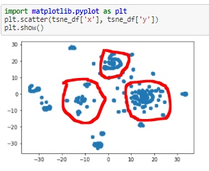

# Cryptocurrency Clusters

Here is a hypothetical problem set that allows an analyst to dig into unsupervised learning while showing some skills in pre-processing data in pandas.  

## Background

* You are on the Advisory Services Team of a financial consultancy. One of your clients, a prominent investment bank, is interested in offering a new cryptocurrency investment portfolio for its customers. The company, however, is lost in the vast universe of cryptocurrencies. They’ve asked you to create a report that includes what cryptocurrencies are on the trading market and determine whether they can be grouped to create a classification system for this new investment.

* You have been handed raw data, so you will first need to process it to fit the machine learning models. Since there is no known classification system, you will need to use unsupervised learning. 

### Data Preparation

* The dataset for this project was obtained from [CryptoCompare](https://min-api.cryptocompare.com/data/all/coinlist).

* Once I loaded in the data, I took the following pre-processing steps to have the dataset make sense for an unsupervised learning model.

  * Removed all rows that have at least one null value.

  * Filtered for cryptocurrencies that have been mined. That is, the total coins mined should be greater than zero.

  * Deleted the `CoinName` from the original dataframe to make all data numeric.

  * Converted the remaining features with text values, `Algorithm` and `ProofType`, into numerical data. 

  * Standardized the dataset using scaling so that columns that contained larger values did not unduly influence the outcome.

### Dimensionality Reduction

* Creating dummy variables dramatically increased the number of features in the dataset. Performing dimensionality reduction with PCA can bring the number of features back down, reducing the complexity of the model. Rather than specify the number of principal components, I defined the level of variance I wanted described by the model, .90, when setting the parameters for the PCA. Performing PCA reduced my feature set from 109 to 84 features.  

* Next, I ran my PCA dataset through a t-SNE model and visually inspected the results, looking for clusters. As can be observed in my Jupyter Notebook file, I did in fact find clusters of crypto using the t-SNE model, suggesting that crypto assets could be classifed.  

### Cluster Analysis with k-Means

Using further clustering analysis with the k-Means technique, I was able to determine that the optimal amount of clusters to classify the crypto data into is 4.  After that, there is diminishing returns on further clustering based on the elbow curve I generated.  

- - -

© 2021 Trilogy Education Services, LLC, a 2U, Inc. brand. Confidential and Proprietary. All Rights Reserved.
